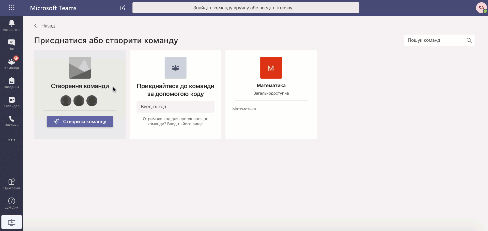

# План
- Загальні питання
    - [Що потрібно для користування Microsoft Teams?](#що-потрібно-для-користування-Microsoft-Teams)
    - [Чи безкоштовний Microsoft Teams?](#чи-безкоштовний-microsoft-teams)
    - [Чи доступна платформа українською?](#чи-доступна-платформа-українською)
    - [Чи зручно користуватись програмою як на комп'ютері, так і на смартфоні?](#Чи-зручно-користуватись-програмою-як-на-компютері-так-і-на-смартфоні)
    - [Що таке Microsoft Teams?](#що-таке-microsoft-teams)
    - [Що таке команда в Microsoft Teams?](#що-таке-команда-в-microsoft-teams)
    - [Чи є обмеження по кількості учасників для команди?](#чи-є-обмеження-по-кількості-учасників-для-команди)
    - [Організація дистанційного навчання з Microsoft Teams](#організація-дистанційного-навчання-з-microsoft-teams)
    - [Віртуальна школа чи університет в Microsoft Teams](#віртуальна-школа-чи-університет-в-microsoft-teams)
    - [Основні ролі Microsoft Teams](#основні-ролі-microsoft-teams)
    - [Вибір типу команди для співпраці в Microsoft Teams](#вибір-типу-команди-для-співпраці-в-microsoft-teams)
    - [Створення віртуального класу чи групи студентів в Microsoft Teams](#створення-віртуального-класу-чи-групи-студентів-в-microsoft-teams)
    - [Створення віртуальної учительської чи кафедри в Microsoft Teams](#створення-віртуальної-учительської-чи-кафедри-в-microsoft-teams)
    - [Створення команди по шаблону](#створення-команди-по-шаблону)
    - [Як змінити команду? (назву, аватар команди тощо)](#як-змінити-команду-назву-аватар-команди-тощо)
    - [Як керувати командою?](#як-керувати-командою)
    - [Як додати нового учасника в команду?](#як-додати-нового-учасника-в-команду)
    - [Як видалити учасника з команди?](#як-видалити-учасника-з-команди)
    - [Організація відеодзвінків із Microsoft Teams](#організація-відеодзвінків-із-microsoft-teams)
    - [Як додати вкладки до каналу?](#як-додати-вкладки-до-каналу)
    - [Як приєднатися до створеної команди?](#як-приєднатися-до-створеної-команди)
    - [Як прикріпити файл/сайт на вкладку каналу?](#як-прикріпити-файлсайт-на-вкладку-каналу)
    - [Для чого потрібні канали в командах?]
    - [Як додати канал до команди?]
    - [Як в каналі створити оголошення?]
    - [Як прикріпити файл до повідомлення?]
    - [Як завантажити файл в Microsoft Teams?]
    - [Як створити миттєву нараду?]
    - [Як організувати спілкування для класу?]
    - [Яка різниця між миттєвою нарадою і нарадою?]
    - [Як запланувати урок/подію/нараду?]
    - [Яка максимальна кількість учасників уроку/події/наради?]
    - [Чи можна транслювати матеріали під час відеозустрічі в Microsoft Teams?]
    - [Microsoft Teams дозволяє записувати відеозустріч?]
    - [Який інструмент допоможе сформувати і поширити завдання для класу?]
    - [Як збирати і оцінювати роботи учнів?]
    - [Як учень побачить що йому задали завдання?]
    - [Як учню здати на перевірку домашню роботу?]
    

## Що потрібно для користування Microsoft Teams?
Спочатку перевірте, чи є у вашого навчального закладу обліковий запис **Office365**. Якщо, раптом, ні, ви можете безкоштовно його зареєструвати на сайті office.com/education. Зверніться зверніться до ІТ адміністратора вашого закладу, він підключить офіс для всіх учасників класу.

## Чи безкоштовний Microsoft Teams?
Інструмент Microsoft Teams є безкоштовним за планом А1 для всіх закладів освіти на постійній основі.

## Чи доступна платформа українською?
⚙ Платформа підтримує українську мову та доступна на комп’ютерах із Windows, Mac, на пристроях з iOS та Android та є веб-версія платформи.

## Чи зручно користуватись програмою як на комп'ютері, так і на смартфоні?
Незалежно від того, яка у вас операційна система: Windows, MacOS, а можливо Android чи iOS Ви з легкістю можете встановити додаток Microsoft Teams. Також Teams доступний в браузерній версії.

## Що таке Microsoft Teams?
**Microsoft Teams** – це уніфікована платформа для спілкування та співпраці, яка поєднує постійний чат на робочому місці, відео зустрічі, зберігання файлів (включаючи співпрацю з файлами) та інтеграцію програм.

Основою платформи є саме **Команди** - колекція людей, розмов, файлів і інструментів. Кожна команда має **Канали** – місце для командних обговорень, присвячених підрозділу, проекту, предмету в школі або темі.

## Що таке команда в Microsoft Teams?
**Команда** - це основний елемент платформи, вона має деяку кількість користувачів, які об'єднані однією спільною метою. Команди можуть створюватися під конкретні проекти (наприклад, проведення якогось заходу чи розробка мобільного додатку) або існувати на постійній основі, відтворювати внутрішню структуру організації (наприклад, по шкільним класам чи по відділам в університеті). Розмови, файли і замітки в каналах видимі тільки учасникам команди.

## Чи є обмеження по кількості учасників для команди?
Кожна команда має обмеження в 5000 учасників. Цієї однієї команди вистачить щоб об'єднати декілька шкіл, тому попередньо сплануйте для яких цілей буде створена команда. Крім цього учасник може мати до 250 команд одночасно на один обліковий запис.

## Організація дистанційного навчання з Microsoft Teams
Платформа дозволяє створювати віртуальні класні кімнати, щоб проводити віртуальні зустрічі, роздавати завдання, передавати файли та спілкуватися один з одним. Завдяки Microsoft Teams, учні можуть навчатися коли завгодно та де завгодно.

💬 **Спілкування.** Спілкуйтеся з учнями/студентами, відповідайте на їхні запитання та допомагайте їм в особистих чатах або спільних каналах.

🎥 **Онлайн-наради.** Проводьте віртуальні уроки та лекції у великих групах, невеликих командах або сам на сам.

📝 **Завдання.** Створюйте завдання, діліться ресурсами, надсилайте відгуки та продовжуйте навчання онлайн.

📚 **Спільна робота з вмістом.** Учні та вчителі можуть працювати над спільними проектами з дому, а також виконувати завдання з будь-якого пристрою в реальному часі.

## Віртуальна школа чи університет в Microsoft Teams
:school: За допомогою **Команд** та інших інструментів платформи MS Teams ви можете з легкістю відтворити структуру вашого освітнього закладу.

Завдяки командам ви можете об'єднати ваших учнів або студентів у класи, залежно від профілю навчання, класу або групи. Крім того, ви можете об'єднати в окремі команди адміністрацію школи та з легкістю відтворити методичні об'єднання або кафедри.

Кожна команда має **Загальний** канал де вчитель може публікувати важливі оголошення щодо проведення занять або ділитися навчальними матеріалами. Крім цього є можливість створити інші тематичні канали за предметами або за функціями які він повинен виконувати (наприклад можна створити канал Посібник, який матиме інструкції як користуватися платформою MS Teams).

## Основні ролі Microsoft Teams
Усі члени команди мають роль, і кожен із них має різні дозволи. Платформа має три основні ролі: власник, учасник, гість.

**Власники** групи управляють певними настройками для команди. Вони додають та видаляють учасників, додають гостей, змінюють настройки команди та обробляють адміністративні завдання. У групі можуть бути кілька власників. Наприклад віртуальний клас де власником є вчитель.

**Учасники** - це люди в команді. Вони спілкуються з іншими учасниками команди в розмовах. Вони можуть переглядати й зазвичай передавати та змінювати файли. Вони також роблять звичайні види співпраці, які власники команди дозволили. Наприклад група студентів де власником може бути староста, а учасниками є інші студенти.

**Гості** це користувач з іншого навчального закладу, якого запрошує власник команди. Гості мають менше можливостей, ніж учасники або власники групи. Прикладом може бути запрошення на відкритий урок в школі викладача з університету.

## Вибір типу команди для співпраці в Microsoft Teams
Для ефективної організації користувачів освітнього закладу платформа пропонує чотири типи команд, а саме: Клас, Професійна навчальна спільнота, Персонал та Інше.

👧🏻👦🏻 **Клас** - дозволяє організувати вчителя та учнів певного класу. У ньому вони спільно працюють над проектами, завданнями, проводять опитування чи тестування. Вчитель може призначати/відстежувати/перевіряти домашні завдання, вести електронний журнал, проводити онлайн-уроки та виконувати інші дії, які відносяться до організації навчального процесу.

👩🏻‍🏫👨🏻‍🏫 **Професійна навчальна спільнота (ПНС)** - потрібна для створення віртуальної команди вчителів чи викладачів. Цю команду формує викладач та запрошує до неї своїх колег, де всі мають доступ до важливих документів, записів онлайн-нарад чи проектів, які розроблюються в межах школи/університету.

👩🏻‍💼👨🏻‍💼 **Персонал** - об'єднує людей, які спільно вирішують адміністративні завдання в школі/університеті й відповідають за її розвиток. Прикладами є команда відділу кадрів чи бухгалтерії, вони є організаційними одиницями університету.

👩🏻‍🎨👨🏻‍💻 **Інше** - цей тип команди підходить для створення бібліотеки, клубів за інтересами, проектів які розроблюються в рамках школи/університету тощо.

## Створення віртуального класу чи групи студентів в Microsoft Teams
1. У лівій частині програми оберіть кнопку **Команди**.
2. Натисніть кнопку **Приєднатися або створити команду**, а потім **Створити команду**.
3. Виберіть **Клас** як тип команди.
4. Введіть ім'я та *необов'язковий опис* для команди класу, а потім натисніть кнопку **Далі**. Наприклад: "Біологія, 7А клас".

*Під час цього кроку можна також створити нову команду, використовуючи наявну команду як шаблон.*

5. Додайте учнів та вчителя чи старосту, а потім натисніть кнопку **Закрити**.
6. Віртуальний клас створено ✔

## Створення віртуальної учительської чи кафедри в Microsoft Teams
1. У лівій частині програми оберіть кнопку **Команди**.
2. Натисніть кнопку **Приєднатися або створити команду**, а потім **Створити команду**.
3. Виберіть **Професійна навчальна спільнота** як тип команди.
4. Введіть ім'я та *необов'язковий опис* для команди, а потім натисніть кнопку **Далі**. Наприклад: "Учительська".

*Є можливість обрати тип **Конфіденційності**, якщо потрібно обмежити доступ до команди іншим користувачам навчального закладу*

*Під час цього кроку можна також створити нову команду, використовуючи наявну команду як шаблон.*

5. Додайте вчителів чи оберіть створену раніше групу щоб згаяти час, на цьому кроці також потрібно обрати власника, а потім натисніть кнопку **Закрити**.
6. Віртуальна учительська створена ✔

## Створення команди по шаблону
1. У лівій частині програми оберіть кнопку **Команди**.
2. Натисніть кнопку **Приєднатися або створити команду**, а потім **Створити команду**.
3. Виберіть тип команди.
4. Виберіть **Створіть команду, використовуючи наявну команду як шаблон**.
5. Виберіть одну з команд, яка була створена раніше та натисніть кнопку **Вибрати команду**. *Будуть відображатися команди тільки того типу, який був обраний на етапі 3.*
6. Введіть нове ім'я команди та оберіть, що хочете скопіювати у нову команду та натисніть **Створити**.
7. Додайте учасників команди та натисніть **Пропустити**.
8. Команда по шаблону створена ✔

## Як змінити команду? (назву, аватар команди тощо)
1. Обрати команду яку потрібно змінити, відкривши розділ **Команди** який знаходиться у лівій частині програми.
2. Натиснути кнопку **Додаткові параметри ●●●** та обрати **Змінити команду**.
3. Відкриється вікно в якому можна змінити такі відомості команди:
    * Назву
    * Рівень освіти класу (Початкова, середня, післяшкільна середня)
    * Предмет (Мистецтво та дизайн, інженерна справа, Іноземна мова та інші)
    * Аватар

*Якщо команда має тип ПНС, Співробітники, Інше, то можна змінювати Конфіденційність*

4. Коли всі зміни внесено, натиснути кнопку **Оновити**.

Є декілька способів змінити команду (детальніше на відео).

## Як керувати командою?
Функція **Керування командою** дозволяє виконувати різні адмінські функції якщо користувач є власником команди. Ці функії розділені та розташовані на вкладках: Учасники, Канали, Відкладені запити, Параметри, Аналітика, Програми.

* За допомогою вкладки **Учасники** можна переглянути користувачів команди (власників, учасників та гостей) та додавати/видаляти користувачів команди. 
* Вкладка **Відкладені запити** відображає запити на приєднання до команди інших користувачів. **Канали** відповідно відображають список наявних каналів команди. 
* Вкладка **Параметри** допомагає налаштувати дозволи учасників, розважалки (використання Gif, стікерів, мемів) та інше. 
* **Аналітика** відображає активних користувачів та кількість повідомлень. 
* А вкладка **Програми** містить список програм які використовують командою, наприклад програма Forms дає змогу створювати та розміщувати опитування в каналах.

Щоб скористуватися цією функцією здійсніть наступні кроки:

1. Обрати команду, відкривши розділ **Команди** який знаходиться у лівій частині програми.
2. Натиснути кнопку **Додаткові параметри ●●●** та обрати **Керувати командою**.

Є декілька способів відкрити керування команду (детальніше на відео).

## Як додати нового учасника в команду?
1. Обрати команду до якої потрібно додати учасника, відкривши розділ **Команди** який знаходиться у лівій частині програми.
2. Натиснути кнопку **Додаткові параметри ●●●** та обрати **Додати учасника**.
3. Відкривається вікно яке містить поле пошуку учасника. Якщо тип команди Клас, то власник може додати учнів та вчителів; якщо це тип **Співробітники**, то власник додає інших учасників команди.
4. Ввести у поле пошуку користувача, обрати потрібного та натиснути кнопку **Додати**.
5. Якщо список нових учасників сформовано, можна натиснути **Закрити**.
6. Користувача додано ✔

## Як видалити учасника з команди?
1. Обрати команду з якої потрібно видалити учасника, відкривши розділ **Команди** який знаходиться у лівій частині програми.
2. Натиснути кнопку **Додаткові параметри ●●●** та обрати **Керувати командою**.
3. На вкладці **Учасники** розгорнути список **Учасники та гості**.
4. Знайти учасника якого потрібно видалити та натиснути на крестик ✖ поряд з ним.
5. Користувача видалено ✔

## Організація відеодзвінків із Microsoft Teams 
Ми з легкістю можемо запланувати відео-конференцію та запросити до 250 учасників. Така конференція дає можливість поширити екран, транслювати презентацію та працювати разом з інтерактивною дошкою вайтборд.

Ви можете створити миттєву нараду чи запланувати нараду

## Як додати вкладки до каналу?

## Як приєднатися до створеної команди?

## Як прикріпити файл/сайт на вкладку каналу? 

## Для чого потрібні канали в командах?

## Як додати канал до команди?

## Як в каналі створити оголошення?

## Як прикріпити файл до повідомлення?

## Як завантажити файл в Microsoft Teams?

## Як створити миттєву нараду?

## Як організувати спілкування для класу?

## Яка різниця між миттєвою нарадою і нарадою?

## Як запланувати урок/подію/нараду?

## Яка максимальна кількість учасників уроку/події/наради?

## Чи можна транслювати матеріали під час відеозустрічі в Microsoft Teams?

## Microsoft Teams дозволяє записувати відеозустріч?

## Який інструмент допоможе сформувати і поширити завдання для класу?

## Як збирати і оцінювати роботи учнів?

## Як учень побачить що йому задали завдання?

## Як учню здати на перевірку домашню роботу?
